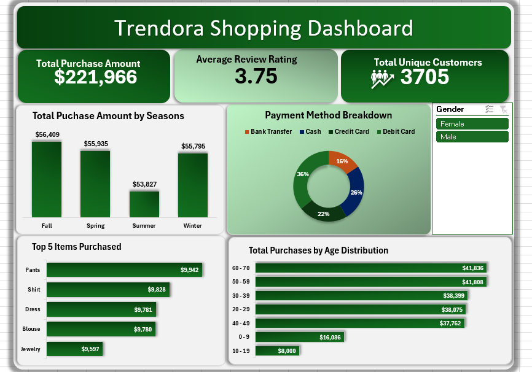
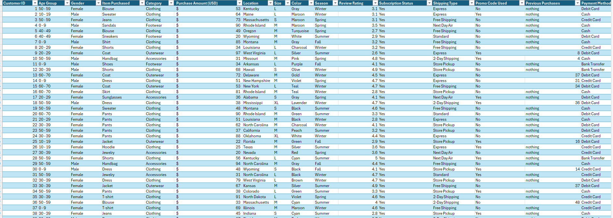

# Trendora Shopping Data Analysis Report
Analyzing customer purchase behavior using Excel dashboards to understand sales performance and buying patterns.

## Executive Summary
- Trendora required a clear and structured way to understand customer purchasing behavior and overall business performance using transactional data.
- Using Microsoft Excel, an interactive dashboard was developed to summarize key performance indicators (KPIs), visualize purchasing trends, and highlight customer behavior patterns.
- The analysis provides insights into total revenue generated, customer participation, top-selling products, seasonal spending trends, and preferred payment methods. These insights support data-driven decision-making and improved business planning.

## The Business Problem
Trendora’s management lacked a centralized view of customer purchase data across products, age groups, and seasons. Existing data was available but not organized in a way that supported quick insights or strategic decisions.
This project aimed to transform raw shopping data into an interactive Excel dashboard that answers critical business questions.

### Key Questions Addressed:
- What is the total purchase revenue generated?
- How many unique customers made purchases?
- Which items are purchased most frequently?
- How does purchasing behavior vary by age group?
- In which seasons do customers spend more?
- What payment methods are most commonly used?

## The Process (Methodology)
### Tools Used:
- Microsoft Excel
- PivotTables
- PivotCharts
- Slicers

## Data Sourcing & Overview
The dataset consists of customer purchase records containing fields such as Customer ID, Age Group, Gender, Item Purchased, Purchase Amount, Season, Review Rating, and Payment Method. Each row represents a single purchase transaction.

## Data Cleaning & Preparation
To ensure accuracy and consistency:
- Inconsistent categorical values (e.g., Gender) were standardized.
- Missing values were replaced with “NA” where applicable.
- Numeric fields were validated and formatted correctly.
- Data integrity checks confirmed that each row represented one transaction.

## Analysis & Insights
### Key Performance Indicators (KPIs)
- Total Purchase Amount (USD): $221,966
- Average Review Rating: 3.75
- Total Number of Unique Customers: 3705

### Product Performance
The Top Items Purchased analysis identifies products with the highest purchase frequency. In cases where multiple products have the same purchase count, ties were included to ensure transparency and accuracy.

### Customer Demographics & Behavior
Purchase distribution by age group highlights which customer segments are most active. This insight helps Trendora understand its core customer base and tailor marketing strategies accordingly.

### Seasonal & Payment Insights
Seasonal analysis reveals periods of increased customer spending, while payment method breakdown shows customer preferences across available payment options.

## Recommendations
Based on the analysis, the following actions are recommended:
- Focus marketing and inventory efforts on top-performing products.
- Capitalize on high-spending seasons through targeted promotions.
- Maintain and optimize the most frequently used payment methods.
- Use demographic insights to personalize marketing campaigns for key age groups.

